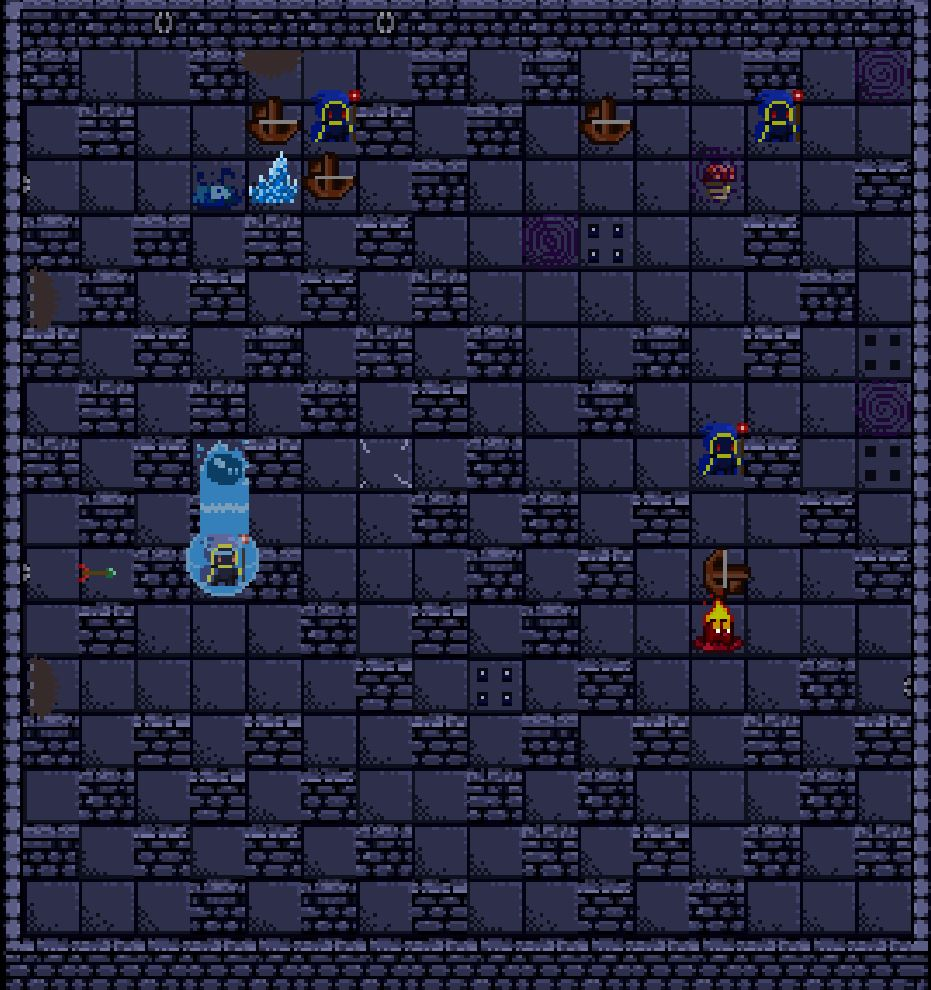

# Soul-Master-Tournament

## Table of Contents

- [General info](#general-info)
- [Demo](#demo)
- [Built With](#built-with)
- [Features](#features)
- [To Do](#to-do)
- [Status](#status)
- [Screenshots](#screenshots)
- [Additional sources](#additional-sources)

## General info

A 2D clone of the classic Bomberman game made in Unity.

## Demo

Available soon...

## Built With

Stack:

- C#
- Unity - 2020.2.3f1
- Piskel

## Features

- Random level generation
- Five souls with different abilities (fire, ice, poisonous, water and evil eye)
- Ten environment hazards (ballista, bear trap, crumbling floor, destructible wall, flamethrower, moving wall, poison arrow launcher, portal, sliding saw and spikes)

## To Do

- Game Loop
- AI Enemies
- Local Coop

## Status

Project is: in progess

## Screenshots

Use Souls to defeat your enemies!

Avoid deadly traps!

All this in randomly generated levels!